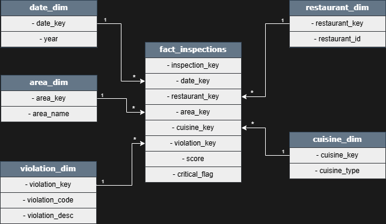

# Data Model

## Overview

The project adopts a **simplified star schema** designed for KPI-driven analysis, comparative reporting, and time-based trend evaluation.

The model prioritizes:

* analytical correctness
* semantic clarity
* performance and stability

Extreme normalization is intentionally avoided in favor of a structure that is easy to reason about, audit, and explain.

---

## Granularity definition

The analytical grain of the model is **inspection–violation**.

This means:

* one inspection can generate multiple rows
* each row corresponds to a detected violation
* the inspection score is repeated across all related rows

The model **does not store one row per inspection**.

As a consequence, all score-based KPIs must explicitly aggregate at the reconstructed inspection level.

---

## Fact table

### fact_inspections

The fact table records inspection outcomes at inspection–violation granularity.

Each row represents **one violation detected during a specific inspection**.

| Field          | Description                                 |
| -------------- | ------------------------------------------- |
| inspection_key | Surrogate row identifier                    |
| date_key       | Foreign key to `date_dim`                   |
| restaurant_key | Foreign key to `restaurant_dim`             |
| area_key       | Foreign key to `area_dim`                   |
| cuisine_key    | Foreign key to `cuisine_dim`                |
| violation_key  | Foreign key to `violation_dim`              |
| score_assigned | Inspection score                            |
| critical_flag  | Indicates whether the violation is critical |

---

## Dimensions

### date_dim

| Field        | Description                 |
| ------------ | --------------------------- |
| date_key     | Integer date key (YYYYMMDD) |
| full_date    | Calendar date               |
| year         | Calendar year               |
| quarter      | Calendar quarter            |
| month_number | Month number                |
| month_name   | Month name                  |

The date dimension supports chronological ordering and rolling-window calculations.

---

### area_dim

| Field     | Description     |
| --------- | --------------- |
| area_key  | Area identifier |
| area_name | Borough name    |

---

### cuisine_dim

| Field        | Description         |
| ------------ | ------------------- |
| cuisine_key  | Cuisine identifier  |
| cuisine_type | Cuisine description |

---

### restaurant_dim

| Field          | Description               |
| -------------- | ------------------------- |
| restaurant_key | Technical surrogate key   |
| restaurant_id  | Original CAMIS identifier |

---

### violation_dim

| Field                 | Description             |
| --------------------- | ----------------------- |
| violation_key         | Technical surrogate key |
| violation_code        | Violation code          |
| violation_description | Text description        |

`violation_description` is retained for interpretability but is not used for aggregations.

---

## Relationships

All relationships follow the same pattern:

* one-to-many
* single-direction
* from dimensions to the fact table

<figure align="center">
  
  <figcaption>Data model layout</figcaption>
</figure>

No bidirectional relationships or bridge tables are used, in order to:

* prevent filter ambiguity
* preserve predictable aggregation behavior
* keep the model easy to reason about

---

## Inspection identity reconstruction

Because inspections are stored across multiple rows, a **derived inspection identifier** is used at the semantic layer to enforce correct aggregation.

This identifier (referred to as `inspection_business_key`) reconstructs the logical inspection entity by combining stable inspection attributes.

Key properties:

* approximately 99.2% uniqueness
* known and documented edge cases
* used exclusively in DAX measures

This identifier is an **implementation detail** and is intentionally excluded from the conceptual data model.

---

## Design principles

* inspection scores aggregate only at the inspection level
* violation metrics operate at row level
* analytical logic is enforced in DAX, not in ETL
* the model favors clarity and robustness over transactional detail

---

*Back to the [README](/README.md)*
