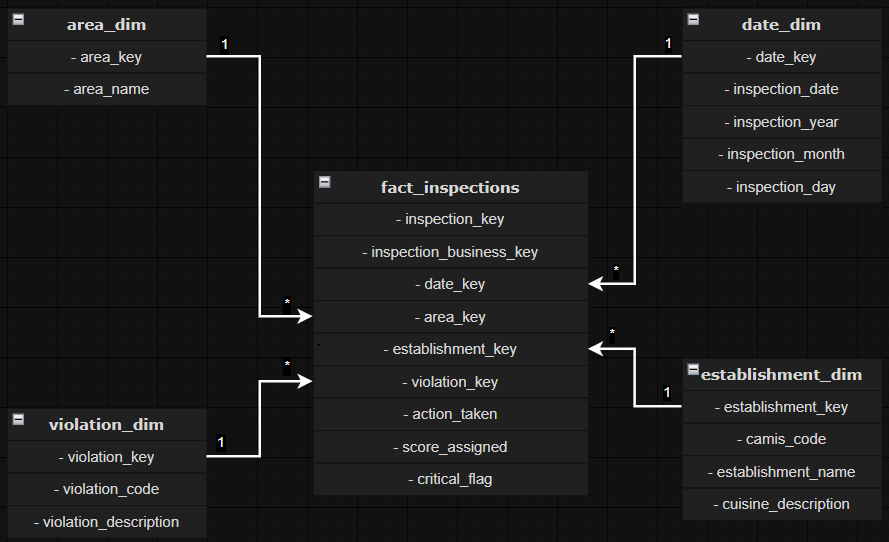

# Data Model

## Overview

The project adopts a **star schema–based analytical model** designed for
KPI-driven analysis, comparative reporting, and time-based trend evaluation.

The model prioritizes:
- analytical correctness
- explicit grain definition
- semantic clarity
- performance and stability

Extreme normalization is intentionally avoided in favor of a structure
that is easy to reason about, audit, and explain.

---

## Granularity Definition

The model resolves the mixed-grain nature of the source data by separating
inspection-level and violation-level information into **two coordinated fact tables**.

### Source grain
- Original dataset grain: **inspection × violation**
- Inspection scores are duplicated across violations
- No reliable inspection identifier is provided

### Analytical grains
- **Inspection grain:** restaurant-day (approximated)
- **Violation grain:** inspection × violation type

This separation guarantees correct aggregation and avoids score duplication.

---

## Fact Tables

### fact_inspection

The central fact table representing inspection outcomes.

**Grain:**  
1 row = 1 restaurant-day with at least one inspection

Each row represents a reconstructed inspection entity at restaurant-day level.

| Field              | Description                                  |
|--------------------|----------------------------------------------|
| inspection_key     | Surrogate inspection identifier              |
| date_key           | Foreign key to `date_dim`                    |
| establishment_key  | Foreign key to `establishment_dim`           |
| area_key           | Foreign key to `area_dim`                    |
| score_assigned     | Inspection score (worst score of the day)    |
| action_taken       | Canonical action taken                       |

This table is used for all **score-based and inspection-level KPIs**.

---

### fact_inspection_violation

A dependent bridge fact table modeling the relationship between inspections
and violations.

**Grain:**  
1 row = 1 (inspection, violation type)

| Field                     | Description                                  |
|---------------------------|----------------------------------------------|
| inspection_violation_key  | Surrogate row identifier                     |
| inspection_key            | Foreign key to `fact_inspection`             |
| violation_key             | Foreign key to `violation_dim`               |
| critical_flag             | Criticality of the violation in context      |

Duplicate raw records are intentionally collapsed.
This table must always be queried **through `fact_inspection`**.

---

## Dimensions

### date_dim

| Field            | Description                      |
|------------------|----------------------------------|
| date_key         | Surrogate date key               |
| inspection_date  | Calendar date                    |
| inspection_year  | Calendar year                    |
| inspection_month | Calendar month                   |
| inspection_day   | Day of month                     |

Supports chronological ordering and time-based aggregations.

---

### area_dim

| Field     | Description     |
|-----------|-----------------|
| area_key  | Surrogate key   |
| area_name | Borough name    |

---

### establishment_dim

| Field                 | Description                         |
|-----------------------|-------------------------------------|
| establishment_key     | Technical surrogate key              |
| camis_code            | Original CAMIS identifier            |
| establishment_name    | Restaurant name                      |
| cuisine_description   | Cuisine description                  |

---

### violation_dim

| Field                 | Description             |
|-----------------------|-------------------------|
| violation_key         | Technical surrogate key |
| violation_code        | Violation code          |
| violation_description | Text description        |

`violation_description` is retained for interpretability but not used
for aggregations.

---

## Relationships

All relationships follow a strict star-schema pattern:

- one-to-many
- single-direction
- from dimensions to facts

- `date_dim → fact_inspection`
- `area_dim → fact_inspection`
- `establishment_dim → fact_inspection`
- `fact_inspection → fact_inspection_violation`
- `violation_dim → fact_inspection_violation`

<figure align="center">
  
  <figcaption>Data model layout</figcaption>
</figure>

No bidirectional relationships are used in order to:
- prevent filter ambiguity
- preserve predictable aggregation behavior
- keep the model easy to reason about

---

## Inspection Identity

Because the source dataset does not provide a reliable inspection identifier,
inspections are approximated at **restaurant-day level**.

Multiple inspections occurring on the same day for the same establishment
are deterministically collapsed.

Validation analysis shows that fewer than **1% of restaurant-days**
exhibit signals of multiple inspections, making the approximation acceptable
for analytical purposes.

Inspection identity reconstruction is therefore handled **structurally**
in the fact table, not dynamically in DAX.

---

## Design Principles

- Inspection scores aggregate only at inspection grain
- Violation metrics operate at inspection–violation grain
- No analytical logic is embedded in dimensions
- No inspection reconstruction is performed in DAX
- Fact tables are always aggregated before being joined
- The model favors clarity and robustness over transactional detail

---

*Back to the [README](/README.md)*
