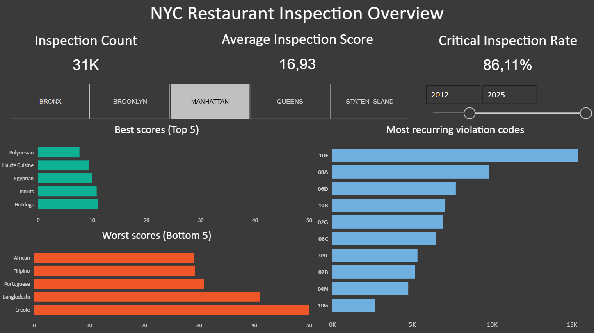

# Dashboard – NYC Restaurant Inspection Overview

This dashboard provides a structured, decision-oriented view of New York City
restaurant health inspections.

Its purpose is to analyze inspection activity, average quality, operational risk,
and medium-term trends using **aggregated, grain-aware KPIs**.

The analysis is built on a data model that separates:
- inspection-level information
- violation-level information

Score-based KPIs are computed at **true inspection grain**
(restaurant-day) to avoid duplication caused by multiple violations
recorded during the same inspection.

---

## Dashboard objectives

The dashboard is designed to:

- identify structural patterns in inspection outcomes
- compare geographic areas and cuisine types
- assess the prevalence of critical health risk
- observe improvement or deterioration trends over time
- support exploratory analysis through filters and contextual tooltips

The dashboard is not intended for operational auditing,
but for **system-level analytical insight**.

---

## Dashboard structure

The dashboard is organized into two complementary analytical panels:

1. **Overview** – cross-sectional analysis of inspection quality and risk  
2. **Time analysis** – medium-term trends based on rolling metrics  

Each panel serves a distinct analytical role and should be interpreted independently.

---

## Overview panel

<figure align="center">
  
  <figcaption>Dashboard overview</figcaption>
</figure>

### Main KPIs

KPIs are calculated within the active filter context
(year and area).

- **Inspection Count**  
  Total number of inspections (restaurant-days).

- **Average Inspection Score**  
  Mean inspection score, aggregated at inspection grain.

- **Critical Inspection Rate**  
  Percentage of inspections with at least one critical violation.  
  This metric is used as an **operational risk indicator**.

---

### Global filters

- time range (years)
- area / borough

All visuals react dynamically to the applied selections.

---

### KPI interpretation

#### Average Inspection Score

Average inspection scores are broadly stable over the analyzed period,
with consistent territorial differences.

The score reflects average inspection quality but does not measure
the cumulative severity or count of violations.

---

#### Critical Inspection Rate

The share of inspections with at least one critical violation
is structurally high, but shows a gradual reduction in recent years.

This metric captures the **frequency of critical risk**, not its intensity.

---

#### Inspection Count

Inspection volume varies across geographic areas and is broadly
proportional to the number of establishments and population size.

The increase observed after 2021 is consistent with post-pandemic
recovery and restored inspection activity.

---

### Cuisine rankings

The overview panel includes two rankings:

- **Best cuisines (Top 5)** – lowest average inspection score  
- **Worst cuisines (Bottom 5)** – highest average inspection score  

Only cuisine types with **a sufficient number of inspections**
are included in rankings, to avoid instability caused by small samples.

A dedicated tooltip provides additional context for each cuisine type:
- average inspection score
- critical inspection rate
- inspection count

---

### Interpretation

Cuisine rankings highlight persistent differences across cuisine types
over the medium term.

Higher average scores indicate greater exposure to operational issues,
without implying direct causality or regulatory intent.

---

### Most recurring violation codes

This chart displays the most frequent violation codes
across all inspections.

No one-to-one relationship is assumed between individual
violation codes and inspection scores.

Inspection scores reflect the **overall combination of violations**
detected during the same inspection.

A dedicated tooltip provides:
- violation code
- violation description
- total occurrence count

---

### Interpretation

Some violation codes recur systematically, indicating
structural hygiene or operational issues.

Frequency alone should not be interpreted as severity.

---

## Time analysis panel

<figure align="center">
  
  <figcaption>Time trends</figcaption>
</figure>

The second panel focuses on how key indicators evolve over time.

---

### Selectable metrics

A field parameter allows analyzing three metrics using the same visual:

- **Average Inspection Score (3Y Rolling)**
- **Critical Inspection Rate (3Y Rolling)**
- **Inspection Count (3Y Rolling)**

Each metric must be interpreted independently.
The Y-axis adapts automatically to the selected measure.

---

### 3-year rolling window rationale

All time-based metrics use an **aggregated 3-year rolling window**.

This approach:
- reduces annual volatility
- preserves sensitivity to structural changes
- avoids distortions caused by short-term noise

For the Critical Inspection Rate, some volatility remains unavoidable
because the metric is a ratio between counts.

Longer windows or cumulative baselines are intentionally avoided
to preserve interpretability.

---

### Trend interpretation

#### Average Inspection Score (3Y Rolling)

The rolling score shows stable, controlled dynamics.
The rolling window smooths annual fluctuations without hiding
structural changes.

---

#### Critical Inspection Rate (3Y Rolling)

The critical inspection rate peaks around 2021–2022
and then gradually declines.

Persistently high values indicate widespread risk,
with recent improvement signals.

---

#### Inspection Count (3Y Rolling)

Inspection volume shows progressive growth in recent years.

This trend is consistent with increased inspection activity
rather than random variation.

---

## Key methodological choices

- inspection scores are not cumulative over time
- a single inspection may include multiple violations but only one score
- score-based KPIs aggregate at inspection grain (restaurant-day)
- risk is defined as inspections with at least one critical violation
- all aggregation logic is enforced in DAX, not in ETL
- fact tables are aggregated before being combined

---

*Back to the [README](/README.md)*
